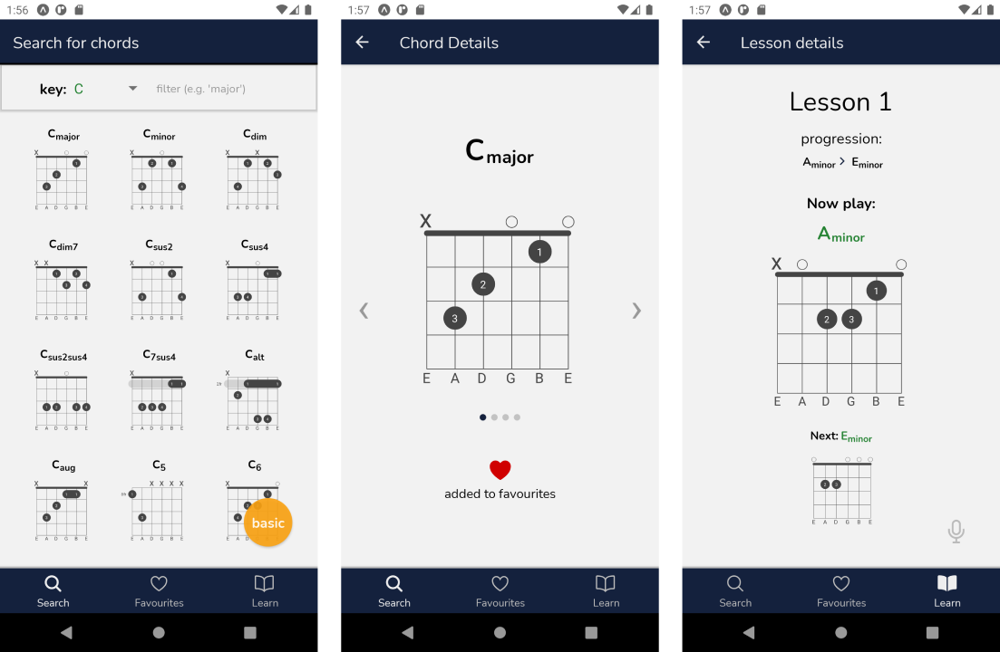

## "Easy chords" app

An Android app made in React Native, according to my own idea.

It allows searching for guitar chords in a huge chords database and it includes a tutorial for beginner guitar players (I've created the content of the tutorial myself as well, more lessons coming soon).

The chords database comes from [this](https://github.com/tombatossals/chords-db) repository (I've just put the data into MongoDB Atlas).

The app also uses [this](https://github.com/tombatossals/react-chords) package to convert chord patterns to SVGs (I had to make few adjustments to the package to make it work with React Native).

I've also made a simple API to get the data from the database (it uses serverless functions on Vercel).

To preview the app you need to download [Expo](https://play.google.com/store/apps/details?id=host.exp.exponent&hl=pl&gl=US) app from Google Play Store.

Then, go to [this link](https://expo.io/@g-czajk/easy-chords) and follow the instructions.

The app will ask you to allow microphone recording in the tutorial screen. You need to allow it to make the tutorial work properly, as in the tutorial screen the app measures the input sound level to determine whether to automatically skip between the chords (works best if you try it with a guitar).

Some screenshots:

## Aplikacja "Easy chords"

Aplikacja na Android stworzona w React Native według własnego pomysłu.

Umożliwia wyszukiwanie akordów gitarowych w sporej bazie danych akordów oraz zawiera samouczek dla początkujących gitarzystów (treść samouczka również przygotowałem we własnym zakresie, wkrótce dodam więcej lekcji).

Baza danych akordów pochodzi z [tego](https://github.com/tombatossals/chords-db) repozytorium (umieściłem tę bazę w MongoDB Atlas).

Aplikacja korzysta z [tej](https://github.com/tombatossals/react-chords) paczki w celu konwertowania schematów akordów do SVG (dokonałem kilku poprawek w tej paczce, by mogła działać prawidłowo również w React Native).

W celu podglądu aplikacji należy pobrać aplikację [Expo](https://play.google.com/store/apps/details?id=host.exp.exponent&hl=pl&gl=US) z Google Play Store.

Następnie należy przejść pod [ten link](https://expo.io/@g-czajk/easy-chords) i wykonać instrukcje.

Na ekranie samouczka aplikacja zapyta o uprawnienia do nagrywania dźwięku. Nadanie uprawnień jest wymagane w celu prawidłowego działania samouczka - w ekranie samouczka aplikacja mierzy poziom natężenia dźwięku i na tej podstawie automatycznie zmienia akordy, co najlepiej funkcjonuje jeśli użyjemy gitary.
